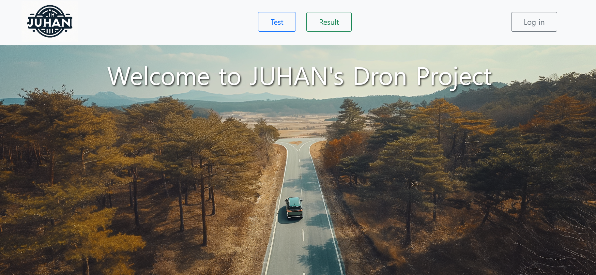

1. yolo 파인튜닝 ( base model : NANO 모델 사용 ( https://github.com/stephansturges/NANO ) ) 
  -WALDO 모델보다 경량화 된 모델.
  - yolo 작업 후 파노라마 작업을 할지 , 파노라마 작업 후 결과물에 yolo 작업을 할지에 대한 고민 
    -yolo 작업을 먼저하게 되면 매 사진마다 작업을 해야하고 , 프로젝트 목적에 큰 의미가 없다고 생각 ( 최종결과물이 지저분해 도로의 상태를 잘 나타내지 못할것 같았음 ) 
    -파노라마 작업을 먼저하고 결과물에 yolo 작업을 해보니, 파노라마 사진이 너무 커서 yolo 작업이 불가능했음. (검출불가)
    -모델의 한계 등등을 고려해서 그래도 적용가능한 yolo 작업을 먼저 실행하기로. 
2. OpenCV 를 사용해 검출한 객체 inpaint 적용
3. 네이버 클라우드 연동하기
  -https://guide.ncloud-docs.com/docs/storage-storage-8-2
  -boto3 사용 
  -pip install boto3
  -이미지 업로드시 버전 충돌 
    -10.3.0 / 4.9.0.80 -> pip install Pillow==9.0.0 opencv-python==4.5.5.64 
    -그래도 충돌나서 pillow 로 파일 읽어서 cv 작업할수있게 np 변환후 image_path 가아닌 file 로 작업 
    -FileNotFoundError: [Errno 2] No such file or directory: b'' -> 업로드 파일에 gps 정보가 없을때. 
      -piexif.load(img.info.get('exif', b'') or piexif.dump({}) -> dump 도 추가해주면됨.  
4. Django 프로젝트 생성
  -django-admin startproject dron_project
  -python manage.py runserver 
  -앱추가 : python manage.py startapp myapp
  -html 
    - 시작하기 : https://getbootstrap.kr/docs/5.3/getting-started/introduction/
  -html 파일을 못 불러왔을때(경로없다고) -> 
  -settings 에 templates 에서 "DIRS": [os.path.join(BASE_DIR, 'templates')] 로 수정
  -파일 업로드시 url 경로 확인 /api/ 넣어주었음 (통상적으로 쓰는 방법)
    -main url 에 uploads/url.py 에 있는 모든 주소를 연결해주 었으므로 한번만 해도됨. 
  -View 에 함수 생성 -> url 에 그 함수랑 이어줄 주소 설정 -> jscript 에서  그 함수를 이용해서 정보 전달 
  -yolo.py import 경로 오류가 발생해서
    manage.py 에 그냥 다음으로 변경
    ```
    if __name__ == "__main__":
    project_root = os.path.dirname(os.path.abspath(__file__))
    sys.path.append(os.path.join(project_root, '..'))

    os.environ.setdefault('DJANGO_SETTINGS_MODULE', 'Dron_Project.settings')
    from django.core.management import execute_from_command_line
    execute_from_command_line(sys.argv)
    main()
    ```
      ->
    win32, PTGui 설정 후 Dron_project modul 을 찾을 수 없다하여.. manage.py 다시 수정해주었음 
      -> yolo import 에러나는건 그냥 경로 맞춰줌 
  -Test 버튼에서 이미지 업로드 및 다운로드하여 yolo 작업, 파노라마 작업 자동화후 다시 result 버킷으로 업로드
  -Result 버튼에서 업로드된 result 버킷의 사진 목록을 가져오기


5. 위치정보를 포함한 EXIF 데이터 만들기 
  -label 데이터의 csv 파일에 있는 gps 정보만 추출하여 이미지에 이식
  -현재 csv 파일에서 필요한 데이터 : 위도경도(gps) ,고도, 방향 ( 요:헤딩 , 피치 : 기울기 , 롤 : 카메라 회전 )
6. 파노라마 작업 
  -PTGui는 Pro 버전이 아닌이상 COM 자동화가 불가능해서 파이썬에서 사용불가.. ( 385유로 =50만원 정도..)
  -KRPano 는 설치버전이 아니어서 COM 자동화가 안되는것 같음
  -opencv 의 stitch 기능을 통해 파노라마 작업. 
    -정밀도가 떨어지고 좌우로 붙여진다는 점이 한계
7. 세번째 모달 만들어서 result 파노라마 표시하기. 
  -세번째 모달을 팝업 하는데 있어서 오류. 
  -이벤트 버블링 ( 부모 요소로 전파되는것 ) 때문이었음. event.stopPropagation() 설정해주었음. 
  -클라우드에서 result 버킷에서 이미지 가져오기 완료
  -이미지 보여줄 때 비율 맞춰야함. 

